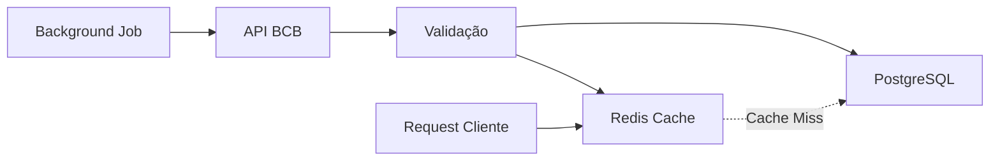

# BrEconomy API

> API moderna e eficiente para consulta de indicadores econômicos brasileiros em tempo real

[](https://dotnet.microsoft.com/)
[](https://www.postgresql.org/)
[](https://redis.io/)
[](https://www.docker.com/)

## Sobre o Projeto

BrEconomy é uma API RESTful que fornece acesso simplificado aos principais indicadores econômicos do Brasil, consumindo dados oficiais do **Banco Central do Brasil (BCB)**. O projeto foi desenvolvido com foco em **performance**, **escalabilidade** e **manutenibilidade**, utilizando as melhores práticas de desenvolvimento de software.

## Ambiente de Produção

- **Base URL**: `https://br-economy.onrender.com`
- **API**: hospedada no **Render**
- **Cache Redis**: hospedado no **Render**
- **Banco PostgreSQL**: hospedado no **Neon**

### Diferenciais

- **Alta Performance**: cache distribuído com Redis para reduzir latência
- **Atualização Automática**: Background jobs mantêm os dados sempre atualizados
- **Arquitetura Limpa**: Design pattern orientado a reutilização e baixo acoplamento
- **Zero Duplicação**: Arquitetura genérica elimina código repetitivo
- **Container-Ready**: Docker Compose para ambiente completo com um comando
- **Múltiplos Indicadores**: SELIC, CDI, IPCA, Dólar e mais

---

## Arquitetura e Design

### Decisões Técnicas

O projeto foi arquitetado seguindo princípios sólidos de engenharia de software:

#### **1. Job Pattern com Herança Genérica**

```
GenericIndicatorUpdateJob (Classe Abstrata)
    ├── SelicCurrentJob
    ├── IpcaYtdJob
    ├── CdiYtdJob
    └── DolarCurrentJob
```

**Por que essa abordagem?**
- ✅ **DRY (Don't Repeat Yourself)**: Lógica de atualização escrita uma única vez
- ✅ **Extensibilidade**: Adicionar novo indicador = 15 linhas de código
- ✅ **Manutenibilidade**: Bugs corrigidos na base beneficiam todos os indicadores
- ✅ **Type Safety**: Cada job tem seu logger e configurações específicas

#### **2. Estratégia de Cache Multi-Camadas**

```
Request → Redis (< 5ms) → PostgreSQL (Fallback) → BCB API (Cold Start)
```

**Benefícios:**
- **Performance**: prioridade de leitura no cache
- **Resiliência**: Banco como fallback se Redis cair
- **Economia**: Reduz requisições à API do BCB
- **UX**: Latência consistente e previsível

**Observação importante:**
- Na ausência de cache, a API responde via banco e retorna o header `Data-Source: database`.
- Quando a resposta vem do cache, retorna `Data-Source: cache`.

#### **3. Background Services Independentes**

Cada indicador possui seu próprio `BackgroundService`:
- **Isolamento**: Falha em um não afeta outros
- **Flexibilidade**: Intervalos de atualização personalizados
- **Observabilidade**: Logs específicos por indicador

---

## Stack Tecnológica

### Backend
- **.NET 10** - Framework moderno e performático
- **ASP.NET Core** - API RESTful
- **Entity Framework Core** - ORM para PostgreSQL
- **Background Services** - Jobs assíncronos nativos

### Infraestrutura
- **PostgreSQL 16** - Banco de dados relacional
- **Redis 7** - Cache distribuído em memória
- **Docker & Docker Compose** - Containerização

### Padrões e Práticas
- **Arquitetura por Features** - Separação por contexto funcional
- **Dependency Injection** - Inversão de controle
- **Template Method Pattern** - Jobs genéricos
- **Fallback de Configuração por Ambiente** - `env var` em produção e `appsettings` no ambiente local

---

## Indicadores Disponíveis

| Indicador | Descrição | Código BCB | Atualização |
|-----------|-----------|------------|-------------|
| **SELIC** | Meta da taxa básica de juros | 432 | 24h |
| **IPCA (YTD)** | Inflação acumulada no ano | 13522 | 24h |
| **IPCA (12M)** | Inflação últimos 12 meses | 433 | 24h |
| **CDI (YTD)** | CDI acumulado no ano | 4391 | 24h |
| **CDI (12M)** | CDI últimos 12 meses | 4392 | 24h |
| **Dólar PTAX** | Cotação oficial do dólar | 1 | 24h |

---

## Como Executar

### Pré-requisitos

- [Visual Studio 2022+](https://visualstudio.microsoft.com/) com suporte a Docker
- [Docker Desktop](https://www.docker.com/products/docker-desktop)

### Opção Única (Recomendada): Docker Compose pelo Visual Studio

```bash
# Clone o repositório
git clone https://github.com/CaioChiabai/br-economy.git
cd br-economy
```

Passos no Visual Studio:

1. Abra a solução `BrEconomy.slnx`.
2. Defina **Docker Compose** como projeto de inicialização.
3. Pressione **F5** (ou clique em **Start Debugging**).

Isso sobe automaticamente os 3 serviços locais:
- `breconomy.api`
- `db` (PostgreSQL)
- `redis`

URLs locais:
- API: `http://localhost:8080`
- Swagger: `http://localhost:8080/swagger`

### Execução via terminal (alternativa)

```bash
# Sobe API + PostgreSQL + Redis
docker compose up -d
```

---

## Endpoints

### **GET** `/api/v1/indicators/selic/current`
Retorna a meta SELIC atual

**Resposta:**
```json
{
  "value": 15.00,
  "date": "2026-01-30",
  "lastVerification": "2026-01-31T10:30:00Z"
}
```

### **GET** `/api/v1/indicators/ipca/ytd`
Retorna o IPCA acumulado no ano

### **GET** `/api/v1/indicators/cdi/ytd`
Retorna o CDI acumulado no ano

### **GET** `/api/v1/indicators/dolar/current`
Retorna a cotação atual do dólar PTAX

### **GET** `/api/health`
Health check da aplicação

### Header de observabilidade

Nos endpoints de indicadores, a API informa a origem da resposta:

- `Data-Source: cache`
- `Data-Source: database`

---

## Como Funciona

### Fluxo de Atualização



1. **Background Jobs** executam a cada 24h
2. Buscam dados atualizados na API do BCB
3. Validam e persistem no PostgreSQL
4. Atualizam cache no Redis (TTL: 25h)
5. Requisições servidas diretamente do cache

### Configuração por Ambiente

- **Banco**: usa `DATABASE_URL` quando disponível; em local usa `ConnectionStrings:DefaultConnection`.
- **Redis**: usa `REDIS_URL` quando disponível; em local usa `Redis:Configuration`.

### Estratégia de Resiliência

- ✅ Retry automático em caso de falha de rede
- ✅ Timeout de 30s para requisições ao BCB
- ✅ Logs estruturados para troubleshooting
- ✅ Validação de dados antes de persistir
- ✅ Cache com expiração inteligente

---

## Estrutura do Projeto

```
BrEconomy.API/
├── Data/
│   └── AppDbContext.cs           # Contexto do EF Core
├── Domain/
│   └── Entities/
│       └── EconomicIndicator.cs  # Entidade principal
├── Features/
│   ├── Shared/
│   │   └── GenericIndicatorUpdateJob.cs  # Job base genérico
│   ├── Selic/
│   │   ├── Job/
│   │   │   └── SelicCurrentJob.cs        # Job específico
│   │   └── SelicController.cs            # Endpoints
│   ├── IPCA/
│   ├── CDI/
│   └── Dolar/
├── Migrations/                   # Migrações do banco
└── Program.cs                    # Configuração da aplicação
```

**Organização por Feature**: Cada indicador é uma feature isolada, facilitando manutenção e evolução.

---

## Testando

```bash
# Teste com curl
curl -i http://localhost:8080/api/v1/indicators/selic/current

# Ou use o arquivo .http incluído no projeto
# (compatível com VS Code REST Client)
```

Com `-i`, você também visualiza o header `Data-Source`.

## Contribuindo

Contribuições são bem-vindas! Para contribuir:

1. Fork o projeto
2. Crie uma branch para sua feature (`git checkout -b feature/AmazingFeature`)
3. Commit suas mudanças (`git commit -m 'Add some AmazingFeature'`)
4. Push para a branch (`git push origin feature/AmazingFeature`)
5. Abra um Pull Request

---

## Autor

**Caio Chiabai**

- GitHub: [@CaioChiabai](https://github.com/CaioChiabai)
- LinkedIn: [Caio Chiabai](https://linkedin.com/in/caiochiabai)

---

## Agradecimentos

- [Banco Central do Brasil](https://www.bcb.gov.br/) - Fonte dos dados
- Comunidade .NET - Ferramentas e bibliotecas incríveis

---

<div align="center">

**Se este projeto foi útil para você, considere dar uma estrela!**

Made in Brazil

</div>